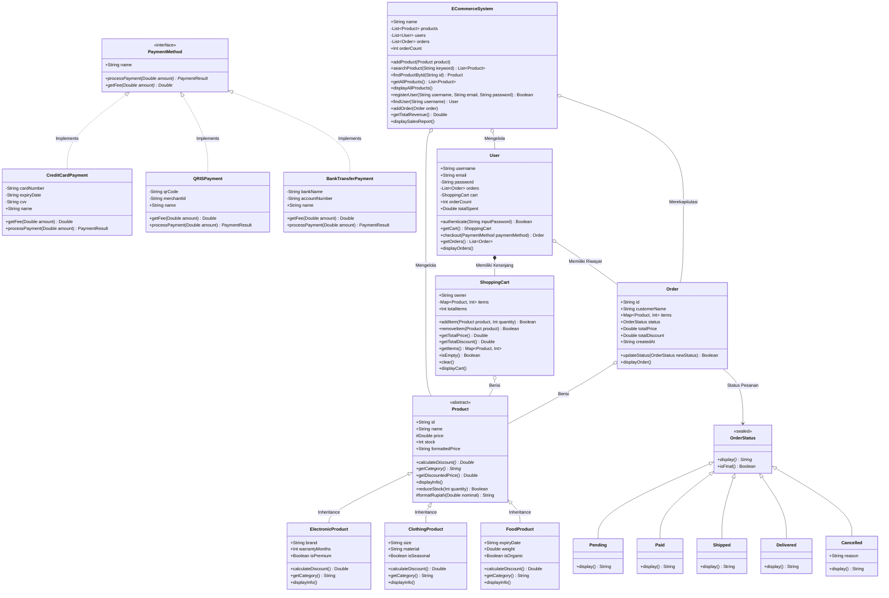

#  Sistem Manajemen E-Commerce

<p align="center">
  <a href="https://kotlinlang.org/"></a>
  <a href="https://openjdk.org/"></a>
  <a href="https://kotlinlang.org/docs/jvm-get-started.html"></a>
  <a href="https://polman-bandung.ac.id/"></a>
  <a href="LICENSE"></a>
</p>

Implementasi komprehensif **Sistem Manajemen E-Commerce** berbasis bahasa pemrograman **Kotlin** untuk memenuhi Tugas Praktikum Kelompok Mata Kuliah Pemrograman Berorientasi Objek (PBO). Sistem ini mengintegrasikan secara utuh **empat pilar utama OOP** (Enkapsulasi, Pewarisan, Polimorfisme, dan Abstraksi), fitur tingkat lanjut Kotlin (*Sealed Classes*, *Smart Casting*, *Safe Casting*), serta standarisasi dokumentasi kode menggunakan **KDoc**.

---

##  Informasi Proyek & Anggota Tim

- **Politeknik Manufaktur Bandung**
- **Jurusan**: Teknik Otomasi Manufaktur dan Mekatronika
- **Program Studi**: Teknologi Rekayasa Informatika Industri
- **Kelas**: 2 AEC-1
- **Semester**: Gasal 2026/2027
- **Mata Kuliah**: Pemrograman Berorientasi Objek (PBO)
- **Kelompok**: Kelompok 1

###  Daftar Anggota Kelompok:

| No | Nama Anggota | NIM |
|:---:|:---|:---:|
| 1 | **Abdul Majid** | 225443001 |
| 2 | **Farhan Maulana** | 225443008 |
| 3 | **Kiyoshi Oloan Raphael Sitorus** | 225443012 |
| 4 | **Muhamad Farrel Attala** | 225443013 |
| 5 | **Muhammad Ihsan Juliansah** | 225443017 |
| 6 | **Muhammad Izzudin Irsyad** | 225443018 |
| 7 | **Naufal Rabbani** | 225443022 |

---

##  Ringkasan Fitur Sistem

Sistem ini memodelkan transaksi toko daring (*online marketplace*) kampus secara modular:

1. **Katalog Produk Dinamis**: Mendukung berbagai jenis produk (Elektronik, Pakaian, Makanan) dengan aturan spesifikasi dan perhitungan diskon khusus untuk masing-masing kategori.
2. **Keranjang Belanja Real-Time (`ShoppingCart`)**: Mengelola penambahan dan penghapusan unit belanja dengan mekanisme pemotongan stok dan pengembalian stok otomatis secara aman.
3. **Pemesanan Tervalidasi (`Order`)**: Menerbitkan nota pesanan transaksi dengan ID unik (`ORD-...`), pencatatan waktu otomatis (`LocalDateTime`), dan snapshot barang belanjaan.
4. **Alur Status Transaksi Terproteksi (`OrderStatus`)**: Memanfaatkan *Sealed Class* untuk mengontrol siklus hidup pesanan (`Pending` ➔ `Paid` ➔ `Shipped` ➔ `Delivered` / `Cancelled`) serta mencegah manipulasi saat status sudah final.
5. **Gerbang Multi-Metode Pembayaran (`PaymentMethod`)**: Menerapkan kontrak interface pembayaran yang mendukung ragam metode: **Kartu Kredit** (fee 2%), **QRIS** (fee 0.5%), dan **Transfer Bank** (fee 1%, min. Rp 5.000).
6. **Autentikasi & Akun Pengguna (`User`)**: Menjamin keamanan data sensitif pelanggan dengan menyembunyikan password serta memfasilitasi pelacakan riwayat belanjaan dan total pengeluaran.
7. **Pusat Rekapitulasi & Laporan Penjualan (`ECommerceSystem`)**: Pengendali utama (*Main Controller*) yang merekap jumlah transaksi pesanan dan total omset pendapatan (*revenue*) toko.

---

##  Analisis Penerapan 4 Pilar OOP

```
                ┌─────────────────────────────────────────────────────────┐
                │                  4 PILAR UTAMA OOP                      │
                └────────────────────────────┬────────────────────────────┘
         ┌───────────────────┬───────────────┴───────────────┬───────────────────┐
         ▼                   ▼                               ▼                   ▼
  [ ENKAPSULASI ]     [ PEWARISAN ]                  [ POLIMORFISME ]      [ ABSTRAKSI ]
  - protected price   - Product (Abstract)           - Dynamic Dispatch    - abstract class Product
  - private password  - ElectronicProduct            - Interface Polymorph - interface PaymentMethod
  - private set cart  - ClothingProduct              - Smart Casting (is)  - sealed class OrderStatus
  - private mutables  - FoodProduct                  - Safe Casting (as?)  - sealed class PaymentResult
```

### 1. Enkapsulasi (Encapsulation)
Menyembunyikan detail implementasi internal dan melindungi data sensitif dari modifikasi luar yang tidak sah:
- **Proteksi Harga (`protected var price`)**: Harga dasar pada [`Product`](src/product/Product.kt) dilindungi dengan modifier `protected` dan setter `private`, sehingga pihak luar tidak dapat mengubah harga secara sembarangan, namun subclass tetap dapat menghitung diskon. Konsumen luar hanya dapat membaca harga terformat melalui getter `formattedPrice`.
- **Proteksi Kata Sandi (`private val password`)**: Properti `password` pada kelas [`User`](src/user/User.kt) bersifat `private` tanpa getter publik. Verifikasi identitas hanya dapat dilakukan melalui metode `authenticate(inputPassword)`.
- **Private Setter pada Keranjang (`private set`)**: Properti `totalItems` pada [`ShoppingCart`](src/cart/ShoppingCart.kt) hanya bisa dibaca publik namun perubahannya dibatasi secara privat (`private set`) melalui metode validasi `addItem()`, `removeItem()`, dan `clear()`.
- **Koleksi Privat**: Seluruh koleksi internal (`items`, `orders`, `products`, `users`) bertipe `mutable` dienkapsulasi secara `private`, sedangkan akses luar hanya disediakan melalui representasi salinan read-only (misal: `getItems(): Map<Product, Int>` dan `getOrders(): List<Order>`).

### 2. Pewarisan (Inheritance)
Membangun hierarki kelas terstruktur untuk mempromosikan *code reusability*:
- Kelas induk abstrak [`Product`](src/product/Product.kt) mewariskan atribut umum (`id`, `name`, `price`, `stock`) serta logika dasar (`reduceStock`, `getDiscountedPrice`, `displayInfo`) kepada subclass:
  - [`ElectronicProduct`](src/product/ElectronicProduct.kt): Menambahkan spesifikasi `brand`, `warrantyMonths`, dan `isPremium`.
  - [`ClothingProduct`](src/product/ClothingProduct.kt): Menambahkan spesifikasi `size`, `material`, dan `isSeasonal`.
  - [`FoodProduct`](src/product/FoodProduct.kt): Menambahkan spesifikasi `expiryDate`, `weight`, dan `isOrganic`.
- Subclass memanfaatkan kata kunci `super.displayInfo()` untuk memanggil pencetakan informasi kelas induk sebelum menambahkan rincian spesifik kategori masing-masing.

### 3. Polimorfisme (Polymorphism)
Kemampuan objek untuk merespons pemanggilan metode yang sama dengan perilaku yang berbeda:
- **Polymorphic Reference & Dynamic Dispatch**: Objek turunan yang berbeda (`ElectronicProduct`, `ClothingProduct`, `FoodProduct`) dapat ditampung dalam satu koleksi seragam `List<Product>`. Saat loop memanggil `product.calculateDiscount()`, JVM secara dinamis mengeksekusi rumus diskon milik subclass yang bersangkutan.
- **Interface Polymorphism**: Metode `checkout(paymentMethod: PaymentMethod)` pada `User` menerima interface umum. Objek apa pun yang mengimplementasikan `PaymentMethod` dapat diproses secara fleksibel.
- **Smart Casting**: Menggunakan operator `is` di dalam ekspresi `when` untuk memeriksa tipe objek secara aman, di mana kompiler Kotlin secara otomatis melakukan *smart cast* sehingga atribut spesifik subclass dapat langsung diakses tanpa casting manual.
- **Safe Casting**: Menggunakan operator `as?` untuk melakukan konversi tipe data yang aman ke subclass tujuan tanpa menimbulkan `ClassCastException` jika tipe tidak cocok (menghasilkan nilai `null`).

### 4. Abstraksi (Abstraction)
Menyediakan antarmuka umum tanpa mengekspos rincian implementasi teknis:
- **Abstract Class `Product`**: Menetapkan cetak biru wajib melalui metode abstrak `calculateDiscount(): Double` dan `getCategory(): String`.
- **Interface `PaymentMethod`**: Mendefinisikan kontrak gerbang pembayaran melalui `processPayment(amount: Double): PaymentResult` dan `getFee(amount: Double): Double`.
- **Sealed Class `OrderStatus` & `PaymentResult`**: Membatasi status sistem ke dalam hierarki tertutup sehingga dapat dievaluasi secara ekshaustif (*exhaustive when*) tanpa memerlukan cabang `else`.

---

##  Diagram Kelas Sistem (Mermaid Architecture)



---

##  Aturan Bisnis Diskon & Biaya Transaksi

### 1. Formulasi Diskon Produk

| Kategori | Diskon Dasar | Kondisi Tambahan 1 | Kondisi Tambahan 2 |
|---|:---:|---|---|
| **Elektronik** | 5% | +10% jika `isPremium == true` | +5% jika `warrantyMonths > 24` |
| **Pakaian** | 10% | +15% jika `isSeasonal == true` | +5% jika ukuran `XL`, `XXL`, atau `XXXL` |
| **Makanan** | 5% | +20% jika `isOrganic == true` | - |

### 2. Skema Biaya Administrasi Pembayaran

| Metode Pembayaran | Biaya Layanan (*Fee*) | Aturan Validasi |
|---|:---:|---|
| **Kartu Kredit** | 2% dari nominal belanja | Nomor kartu $\ge$ 16 digit & CVV tepat 3 digit |
| **QRIS** | 0.5% dari nominal belanja | Panjang kode payload QR $\ge$ 10 karakter |
| **Transfer Bank** | 1% dari nominal belanja | Minimum biaya Rp 5.000 & nomor rekening $\ge$ 8 digit |

---

##  Struktur Direktori Repositori

```
Tugas_OOP_Group_1/
├── src/
│   ├── Main.kt                                                               # Entry point & demonstrasi
│   ├── product/
│   │   ├── Product.kt                                                        # Abstract class induk produk
│   │   ├── ElectronicProduct.kt                                              # Subclass produk elektronik
│   │   ├── ClothingProduct.kt                                                # Subclass produk pakaian
│   │   └── FoodProduct.kt                                                    # Subclass produk makanan
│   ├── cart/
│   │   └── ShoppingCart.kt                                                   # Manajemen keranjang belanja
│   ├── order/
│   │   ├── Order.kt                                                          # Entitas pesanan
│   │   └── OrderStatus.kt                                                    # Sealed class status pesanan
│   ├── payment/
│   │   ├── PaymentMethod.kt                                                  # Interface pembayaran & sealed class PaymentResult
│   │   ├── CreditCardPayment.kt                                              # Implementasi Kartu Kredit
│   │   ├── QRISPayment.kt                                                    # Implementasi QRIS
│   │   └── BankTransferPayment.kt                                            # Implementasi Transfer Bank
│   ├── user/
│   │   └── User.kt                                                           # Entitas pengguna & autentikasi
│   └── system/
│       └── ECommerceSystem.kt                                                # Main controller sistem e-commerce
├── docs/                                                                     # Direktori laporan proyek
│   └── Kelompok 1_Laporan Tugas Kelompok_Sistem Manajemen E-Commerce.pdf     # Laporan proyek
├── LICENCE                                                                   # Lisensi proyek
└── README.md                                                                 # Dokumentasi proyek
```

---

##  Panduan Menjalankan Program

###  Langkah Awal: Clone Repositori dari GitHub
Buka terminal / command prompt pada direktori kerja Anda, lalu jalankan perintah berikut:
```bash
git clone https://github.com/Dragon-Asce/Tugas_OOP_Group_1.git
cd Tugas_OOP_Group_1
```

---

### Cara 1: Menggunakan IntelliJ IDEA (Direkomendasikan)
1. Buka IntelliJ IDEA, pilih menu **File** ➔ **Open...**, lalu arahkan ke folder hasil clone `Tugas_OOP_Group_1`.
2. Repositori ini telah dilengkapi konfigurasi `.idea` dan `.iml` yang sudah mendaftarkan folder `src/` sebagai **Sources Root** dan menautkan library **KotlinJavaRuntime**.
3. Di toolbar pojok kanan atas, profil **`MainKt`** sudah otomatis tersedia. Anda cukup klik tombol panah hijau ▶️ (**Run**).
4. *Alternatif*: Buka berkas [`src/Main.kt`](src/Main.kt), lalu klik ikon panah hijau ▶️ pada baris fungsi `fun main()`.

> [!NOTE]
> Jika folder `src` belum berwarna biru di Project Explorer setelah di-clone, cukup **klik kanan folder `src`** ➔ pilih **Mark Directory as** ➔ **Sources Root**.

---

### Cara 2: Menggunakan Terminal / Command Line (`kotlinc`)
Pastikan komputer Anda telah terinstal **Kotlin Compiler** (`kotlinc`) dan **Java Runtime Environment** (JRE / JDK 17+).

1. Buka PowerShell atau Command Prompt pada root direktori proyek:
   ```powershell
   cd "...\Tugas_OOP_Group_1"
   ```

2. Lakukan kompilasi seluruh file sumber Kotlin ke dalam satu berkas JAR:
   ```powershell
   $files = (Get-ChildItem -Path src -Filter *.kt -Recurse).FullName
   kotlinc $files -include-runtime -d build/ecommerce.jar
   ```

3. Jalankan aplikasi menggunakan Java:
   ```powershell
   java -jar build/ecommerce.jar
   ```

---

##  14 Skenario Demonstrasi (`Main.kt`)

Fungsi utama program di `Main.kt` mengeksekusi 14 skenario pengujian komprehensif:

```
====================================================
        SELAMAT DATANG DI TOKO ONLINE KAMPUS
====================================================

>>> 1. Inisialisasi Sistem Toko Online Kampus
>>> 2. Penambahan 6 Produk (2 Elektronik, 2 Pakaian, 2 Makanan)
>>> 3. Registrasi User 'budi' dan 'siti' (Serta uji validasi duplikasi username)
>>> 4. Menampilkan Katalog Lengkap Seluruh Produk
>>> 5. User 1 (Budi) Menambah Barang ke Keranjang (Uji validasi kuantitas melebihi stok)
>>> 6. Menampilkan Rincian Keranjang Belanja Budi
>>> 7. Checkout Budi menggunakan Kartu Kredit (Kalkulasi fee 2%)
>>> 8. Rincian Order Budi & Uji Transisi Status Pesanan (Pending ➔ Paid ➔ Shipped ➔ Delivered) Serta uji proteksi pembatalan saat status sudah final
>>> 9. User 2 (Siti) Belanja & Checkout menggunakan QRIS (Kalkulasi fee 0.5%)
>>> 10. Menampilkan Laporan Penjualan Toko (Total Order, Omset Revenue, Rekap Transaksi)
>>> 11. Demonstrasi Polimorfisme (Iterasi List<Product>, Dynamic Dispatch kalkulasi diskon)
>>> 12. Demonstrasi Sealed Class (Evaluasi exhaustive 'when' pada OrderStatus)
>>> 13. Demonstrasi Enkapsulasi (Uji proteksi password, protected price, private set)
>>> 14. Demonstrasi Smart Casting (Pemeriksaan 'is' otomatis cast & safe cast 'as?')
========================================================
   SELURUH DEMONSTRASI FITUR OOP BERHASIL DIJALANKAN!
========================================================
```
